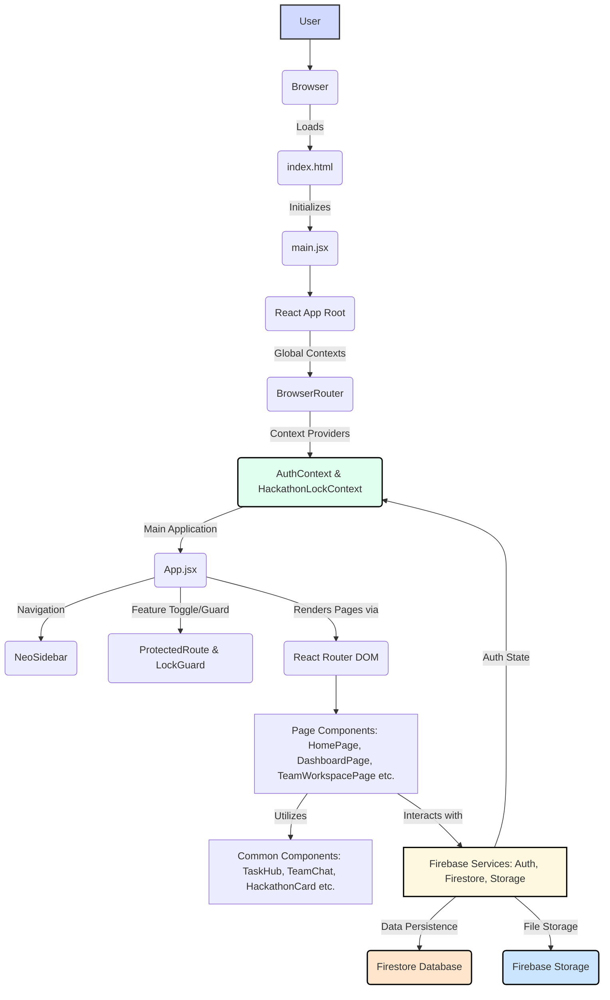

<div align="center">

# ✨ HCP Frontend: Your Command Center for Hackathon Success ✨

*Empowering Teams with Real-time Collaboration & Centralized Workspace for Hackathons.*

[](https://nodejs.org/)
[](LICENSE)
[](package.json)

[Features](#features) • [Installation](#installation) • [Usage](#usage) • [Architecture](#architecture)

</div>

---

### 🚀 The Value Proposition

*   **Problem:** Disjointed tools and fragmented communication hinder hackathon team productivity and synergy.
*   **Solution:** A unified, real-time collaboration platform streamlining team management, task tracking, and creative ideation.
*   **Impact:** Boost team efficiency, foster seamless communication, and maximize your hackathon project's potential.

### ⚡ Quick Start

Jump straight into development:

```bash
yarn && yarn dev
```

---

### 🧠 Architecture Blueprint

Leveraging modern frontend patterns and a robust Firebase backend for a seamless, real-time experience.



#### Architectural Patterns

| Pattern                  | Description                                                | Implementation                 |
| :----------------------- | :--------------------------------------------------------- | :----------------------------- |
| **Component-Based**      | Modular, reusable UI components.                           | `src/components`               |
| **Context API**          | Global state management for authentication and app-wide locks. | `src/context`                  |
| **Protected Routes**     | Restricting access to pages based on user authentication.  | `ProtectedRoute`, `LockGuard`  |
| **Service Integration**  | Decoupled integration with Firebase for backend services.  | `firebaseConfig.js`            |
| **Environment Variables**| Secure management of API keys and sensitive configurations. | `.env` files, `import.meta.env`|

---

### 📂 Project Structure

A high-fidelity overview of the project's directory and file organization.

```
.
├── yarn.lock                   # Yarn package manager lock file
├── vite.config.js              # Vite build tool configuration (React, CORS headers)
├── tailwind.config.cjs         # Tailwind CSS framework configuration
├── src                         # Main application source code
│   ├── pages                   # Top-level route components/views (e.g., TeamWorkspace, HackathonDetail)
│   │   ├── TeamWorkspacePage.jsx   # Collaborative workspace for teams
│   │   └── ... (other pages)       # Login, Register, Profile, Dashboard, Hackathons, LFT Posts
│   ├── main.jsx                # React application entry point (DOM render, global providers)
│   ├── index.css               # Global CSS styles (likely Tailwind base/utilities)
│   ├── firebaseConfig.js       # Firebase project configuration and service initialization
│   ├── design-system           # UI design tokens, themes, or core styling
│   │   └── theme.js            # Defines UI theme (colors, fonts, etc.)
│   ├── context                 # React Context API providers for global state
│   │   ├── HackathonLockContext.jsx # Manages access/state during a hackathon (e.g., locking features)
│   │   └── AuthContext.jsx         # Manages user authentication state
│   ├── components              # Reusable UI components (e.g., TeamChat, TaskHub, NeoSidebar)
│   │   ├── WorkspaceMembersSidebar.jsx # Sidebar for displaying workspace members
│   │   └── ... (other components)  # Collaboration tools, UI elements, modals
│   ├── assets                  # Static assets (images, icons, fonts)
│   ├── App.jsx                 # Main application component (Routes, global layout)
│   └── App.css                 # Application-specific global CSS
├── public                      # Static assets served directly (e.g., vite.svg)
├── postcss.config.cjs          # PostCSS configuration (e.g., for Tailwind)
├── package.json                # Project metadata and dependency manifest
├── index.html                  # Main HTML entry point
└── eslint.config.js            # ESLint linter configuration
```

---

### 🛠️ Setup & Usage

Get the HCP Frontend up and running on your local machine.

#### Prerequisites

*   **Node.js:** `>= 18.x`
*   **Yarn:** `1.x` or `>= 2.x` (or npm if preferred)
*   **Firebase Project:** Configured with Authentication (Email/Password, Google), Firestore, and Storage.

#### Installation

1.  **Clone the repository:**

    ```bash
    git clone https://github.com/your-org/hcp-frontend.git
    cd hcp-frontend
    ```

2.  **Install dependencies:**

    ```bash
    yarn install
    # or npm install
    ```

#### Environment Configuration

Create a `.env` file in the project root and populate it with your Firebase project credentials:

| Variable                        | Description                                     | Example Value           |
| :------------------------------ | :---------------------------------------------- | :---------------------- |
| `VITE_FIREBASE_API_KEY`         | Your Firebase Project API Key.                  | `AIzaSy...`             |
| `VITE_FIREBASE_AUTH_DOMAIN`     | Your Firebase Project Auth Domain.              | `your-project.firebaseapp.com` |
| `VITE_FIREBASE_PROJECT_ID`      | Your Firebase Project ID.                       | `your-project-12345`    |
| `VITE_FIREBASE_STORAGE_BUCKET`  | Your Firebase Storage Bucket URL.               | `your-project.appspot.com` |
| `VITE_FIREBASE_MESSAGING_SENDER_ID` | Your Firebase Messaging Sender ID.              | `1234567890`            |
| `VITE_FIREBASE_APP_ID`          | Your Firebase App ID.                           | `1:1234567890:web:abcdefg` |

#### Running the Application

To start the development server:

```bash
yarn dev
# or npm run dev
```

The application will typically be available at `http://localhost:5173`.

#### Building for Production

To create a production-ready build:

```bash
yarn build
# or npm run build
```

The optimized static files will be generated in the `dist/` directory.

#### Core Dependencies

| Tool             | Purpose                                           | Version (Example) |
| :--------------- | :------------------------------------------------ | :---------------- |
| **React**        | Frontend UI library.                              | `^18.2.0`         |
| **Vite**         | Next-generation frontend tooling (build tool, dev server). | `^5.0.0`          |
| **React Router** | Declarative routing for React applications.         | `^6.21.1`         |
| **Firebase**     | Backend services (Auth, Firestore, Storage).      | `^10.7.1`         |
| **Tailwind CSS** | Utility-first CSS framework for rapid styling.    | `^3.4.1`          |
| **ESLint**       | Code linting to maintain code quality.            | `^8.56.0`         |

---

### 🗺️ Roadmap

Future enhancements planned for the HCP Frontend.

- [ ] **Real-time Notifications:** Implement instant alerts for team activity, messages, and hackathon updates.
- [ ] **Advanced Project Management:** Integrate sophisticated task views like Gantt charts or Kanban boards with dependencies.
- [ ] **Mobile Responsiveness:** Optimize UI/UX for seamless usage across all mobile devices.
- [ ] **Enhanced Profile & Analytics:** Develop detailed user profiles, team performance metrics, and hackathon statistics.
- [ ] **Third-Party Integrations:** Connect with popular developer tools like GitHub, Slack, and Discord.
- [ ] **Admin Dashboard:** Create a dedicated portal for hackathon organizers to manage events, teams, and users.